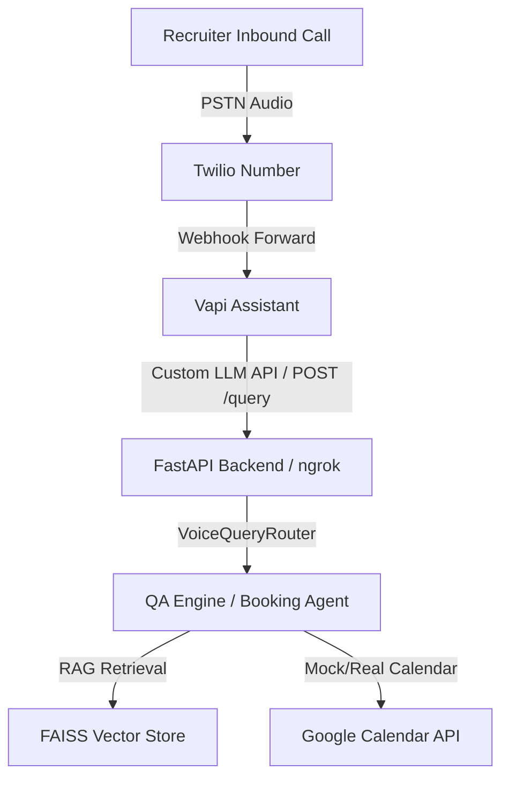

# Siddhant's AI Persona Platform & Telephony Channel

A production-grade AI Persona Platform representing Siddhant (Lead AI Systems Engineer). The system features a grounded Retrieval-Augmented Generation (RAG) QA engine, multi-turn calendar scheduling agent, voice agent with fuzzy phonetic typo correction, and telephony integration.

---

## 🏗️ Telephony Architecture Flow



Twilio and Vapi are utilized solely as the communication/audio streaming layers. All conversational intelligence, intent routing, safety checks, and calendar transaction logic remain completely within the FastAPI application code.

---

## 🎙️ Voice Features & Operational Modes

The platform supports two modes of operation for voice interactions:

### 1. Production Mode
*   **Public Phone Number**: **📞 +1 (516) 738-0429** — Call to speak with Siddhant's AI representative.
*   **Real Telephony Support**: Connected to a live Vapi Assistant via telephone lines.
*   **Speech-to-Text & Text-to-Speech**: Handled by Vapi's dynamic streaming pipeline (e.g., Jennifer friendly voice).
*   **Interview Scheduling**: Full scheduling, rescheduling, and cancellation handled entirely via phone keypad/audio dialogue.

### 2. Local Development Mode
*   **Zero-Dependency Simulator**: Instantly runs locally without any paid API keys or active Twilio/Vapi credentials.
*   **Browser-Based Audio**: Uses the Web Speech API (`webkitSpeechRecognition` & `speechSynthesis`) for real-time speech-to-text and voice generation directly in the web browser.
*   **Visual Status Indicator**: Displays a banner indicating `"Development Simulator Active"` and provides a fallback text chat console to simulate spoken utterances.

---

## 🗓️ Booking Features

Our voice and chat channels support the following calendar actions:
1.  **Availability Lookup**: Dynamic querying of available slots for the next 7 days in the user's timezone.
2.  **Booking Creation**: Creates calendar invitations with structured candidate description metadata, locking slots to prevent concurrent double-booking.
3.  **Rescheduling**: Relocates existing appointments to new slots by candidate email.
4.  **Cancellation**: Deletes calendar bookings and updates the calendar on request.

---

## 📈 Evaluation & Quality Benchmarks

The platform is validated continuously via a custom Evaluation Framework CLI (`runner.py`) measuring retrieval, grounding, safety, and latency.

| Evaluation Metric | Target / Previous Score | Current Score | Change |
| :--- | :---: | :---: | :---: |
| **Retrieval Precision** | 77.8% | **77.8%** | 0.0% |
| **Retrieval Recall** | 100.0% | **100.0%** | 0.0% |
| **Source Coverage** | 86.7% | **86.7%** | 0.0% |
| **Groundedness Score** | 100.0% | **100.0%** | 0.0% |
| **Hallucination Rate** | 0.0% | **0.0%** | 0.0% |
| **Citation Accuracy** | 83.3% | **83.3%** | 0.0% |
| **Booking Reliability** | 100.0% | **100.0%** | 0.0% |
| **Voice Context Retention** | 100.0% | **100.0%** | 0.0% |
| **Safety Score (RedTeam)** | 100.0% | **100.0%** | 0.0% |
| **OVERALL QUALITY SCORE** | 95.4% | **95.4%** | **0.0%** |

---

## ⚡ Quick Start

### 1. Backend Setup
```bash
# Set up virtual environment
python -m venv .venv
.venv\Scripts\activate

# Install dependencies
pip install -r requirements.txt

# Run server
$env:PYTHONPATH="."
python app/main.py
```

### 2. Frontend Setup
```bash
cd frontend
npm install
npm run dev
```

### 3. Running Evaluations
```bash
$env:PYTHONPATH="."
python app/evaluation/runner.py
```
For full telephony setup and integration guides, see the [Telephony Setup Guide](file:///C:/Users/Siddhant/OneDrive/Desktop/SiddhantAI/docs/telephony_setup.md).
