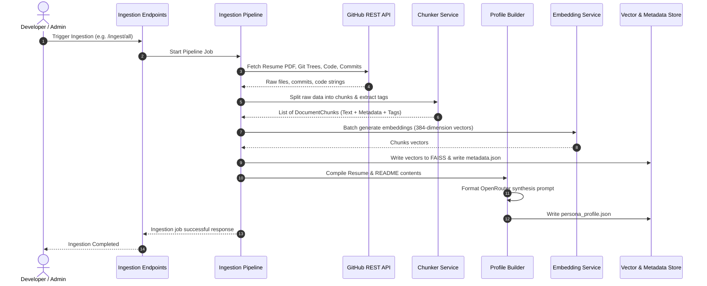

# Knowledge Ingestion Layer: Technical Design Document (Phase 1.1)

This document defines the complete architecture, data models, chunking/indexing strategies, and interfaces for the **Knowledge Ingestion Layer** of the Siddhant AI Persona Platform. 

Phase 1.1 upgrades the system to support **Code-Aware Ingestion** (parsing source code files), compiles an offline **Persona Knowledge Layer** (`persona_profile.json`), and introduces **Retrieval Tags** to chunk metadata to significantly improve semantic search quality and ground answers for recruiters.

---

## 1. System Architecture

Below is the updated system architecture. The pipeline processes resume PDFs, repo metadata, READMEs, recent commits, and source code files. It outputs a FAISS vector index, a metadata dictionary, and a compiled persona profile.

```mermaid
graph TD
    %% Data Sources
    subgraph Data Sources
        PDF[Resume PDF]
        GH_Meta[GitHub Repo Metadata]
        GH_Readme[GitHub READMEs]
        GH_Commits[GitHub Commit History]
        GH_Code[GitHub Code Files]
    end

    %% Ingestion Pipeline
    subgraph Ingestion Layer Backend (FastAPI)
        Orchestrator[Ingestion Pipeline Orchestrator]
        
        subgraph Services
            PDFParser[PDF Parser Engine]
            GHConnector[GitHub REST API Connector]
            Chunker[Document Chunker & Tagging Service]
            EmbedService[sentence-transformers Local Service]
            ProfileBuilder[Persona Profile Builder Service]
        end
        
        subgraph Storage (Local File System)
            FAISSIndex[FAISS Vector Index]
            MetadataStore[JSON Metadata Store]
            PersonaProfile[persona_profile.json]
        end
    end

    %% Flow Connections
    PDF -->|Local Upload| PDFParser
    GH_Meta & GH_Readme & GH_Commits & GH_Code -->|GitHub PAT| GHConnector
    
    PDFParser -->|Raw Resume| Orchestrator
    GHConnector -->|Metadata / Text / Code| Orchestrator
    
    Orchestrator -->|Text & Code Chunks| Chunker
    Chunker -->|Normalized Chunks + Tags| EmbedService
    EmbedService -->|384d Embeddings| FAISSIndex
    Chunker -->|Chunk Text + Metadata + Tags| MetadataStore
    
    Orchestrator -->|Raw Resume & README Text| ProfileBuilder
    ProfileBuilder -->|OpenRouter Request| OR[OpenRouter API]
    OR -->|Synthesized JSON Profile| PersonaProfile

    %% RAG Bridge
    RAG[Future Phase 2: RAG Engine] -.->|Query Vector| FAISSIndex
    RAG -.->|Metadata & Tag Lookup| MetadataStore
    RAG -.->|High-Level Q&A| PersonaProfile
```

---

## 2. Folder Structure

The folder structure is updated to support persona profile persistence:

```
backend/
├── app/
│   ├── __init__.py
│   ├── main.py                 # FastAPI Application entrypoint
│   ├── core/
│   │   ├── __init__.py
│   │   ├── config.py           # Configuration variables (GitHub PAT, OpenRouter Key, paths)
│   │   └── logging.py          # Unified logging setup
│   ├── api/
│   │   ├── __init__.py
│   │   ├── router.py           # Top-level API router
│   │   └── v1/
│   │       ├── __init__.py
│   │       └── endpoints/
│   │           ├── ingestion.py # Endpoints to trigger ingestion & swap index
│   │           └── search.py    # Search & retrieval endpoints (used by RAG)
│   ├── models/
│   │   ├── __init__.py
│   │   ├── document.py         # Pydantic schemas (Document, Chunk, Metadata)
│   │   └── api_schemas.py      # HTTP request/response validation schemas
│   ├── services/
│   │   ├── __init__.py
│   │   ├── parser.py           # Resume PDF parsing (pypdf)
│   │   ├── github.py           # GitHub REST API connectors (trees, README, code, commits)
│   │   ├── chunker.py          # Text splitting & keyword tagging logic
│   │   ├── embeddings.py       # SentenceTransformers embedding generator (all-MiniLM-L6-v2)
│   │   ├── profile.py          # Persona Profile builder (OpenRouter client)
│   │   └── vector_store.py     # FAISS storage adapter (Index & Metadata serialization)
│   └── tests/                  # Basic verification scripts
│       └── test_ingestion.py
├── data/
│   ├── raw/                    # Local storage for raw uploaded PDFs / JSON cache
│   └── vector_db/
│       ├── index.faiss         # Serialized FAISS index file
│       ├── metadata.json       # Key-value mapping of chunk ID to chunk text, metadata, & tags
│       └── persona_profile.json # Synthesized high-level persona profile
├── requirements.txt            # Python dependencies
└── .env                        # Local environment variables
```

---

## 3. Data Flow



---

## 4. Pydantic Models

These models define the strict validation schemas including `retrieval_tags` and `GITHUB_CODE` source types.

```python
from enum import Enum
from typing import Dict, Any, List, Optional
from pydantic import BaseModel, Field
from datetime import datetime

class SourceType(str, Enum):
    RESUME = "resume"
    GITHUB_REPO_METADATA = "github_repo_metadata"
    GITHUB_README = "github_readme"
    GITHUB_COMMIT = "github_commit"
    GITHUB_CODE = "github_code"

class BaseMetadata(BaseModel):
    source_type: SourceType
    source_url: Optional[str] = None
    created_at: datetime = Field(default_factory=datetime.utcnow)
    updated_at: datetime = Field(default_factory=datetime.utcnow)
    retrieval_tags: List[str] = Field(default_factory=list, description="Extracted tech keywords/tags")

class ResumeMetadata(BaseMetadata):
    source_type: SourceType = SourceType.RESUME
    page_number: int
    total_pages: int

class GitHubRepoMetadata(BaseMetadata):
    source_type: SourceType = SourceType.GITHUB_REPO_METADATA
    repo_name: str
    owner: str
    stars: int
    language: Optional[str] = None
    description: Optional[str] = None

class GitHubReadmeMetadata(BaseMetadata):
    source_type: SourceType = SourceType.GITHUB_README
    repo_name: str
    owner: str
    file_path: str = "README.md"
    branch: str = "main"

class GitHubCommitMetadata(BaseMetadata):
    source_type: SourceType = SourceType.GITHUB_COMMIT
    repo_name: str
    owner: str
    commit_sha: str
    author: str
    commit_date: datetime
    changed_files: List[str]

class GitHubCodeMetadata(BaseMetadata):
    source_type: SourceType = SourceType.GITHUB_CODE
    repo_name: str
    owner: str
    file_path: str
    branch: str = "main"

class DocumentChunk(BaseModel):
    id: str = Field(description="Unique hash of parent ID + chunk index")
    parent_id: str = Field(description="ID of the parent document")
    text: str = Field(description="Text segment of this chunk")
    chunk_index: int = Field(description="Positional index of chunk within parent document")
    metadata: Dict[str, Any] = Field(description="Merged parent metadata + chunk attributes (includes retrieval_tags)")

class SearchResult(BaseModel):
    chunk_id: str
    text: str
    score: float = Field(description="FAISS L2/IP search distance score")
    metadata: Dict[str, Any]

# Persona Profile Model
class ProjectSummary(BaseModel):
    name: str
    description: str
    technologies: List[str]
    repo_url: Optional[str] = None

class PersonaProfile(BaseModel):
    name: str = "Siddhant"
    education: List[str]
    core_skills: List[str] = Field(description="Primary programming languages, frameworks, tools")
    top_projects: List[ProjectSummary]
    interests: List[str]
    summary: str = Field(description="Synthesized professional summary")
```

---

## 5. Metadata & Retrieval Tags Design

### Source-Specific Metadata Fields
To maintain complete source grounding:
1. **GitHub Code (`github_code`):**
   * `source_type`: `"github_code"`
   * `repo_name`: Name of the repository.
   * `owner`: Owner handle.
   * `file_path`: Relative path of file (e.g. `src/auth/jwt.py`).
   * `branch`: Target Git branch.
   * `source_url`: `https://github.com/{owner}/{repo_name}/blob/{branch}/{file_path}`

### Retrieval Tags Implementation
During chunking, the chunker extracts **`retrieval_tags`** based on:
1. **Directory Structure:** Directory names (e.g., `auth`, `routes`, `services`, `controllers`) are automatically appended.
2. **Keyword Extraction:** A predefined regex mapping checks for standard engineering concepts, patterns, and technologies:
   - *Security:* `jwt`, `auth`, `session`, `cookie`, `oauth`, `role`
   - *Database:* `postgres`, `sql`, `redis`, `mongodb`, `prisma`, `sqlalchemy`
   - *Frameworks & Tools:* `fastapi`, `react`, `nextjs`, `docker`, `kubernetes`, `tailwind`, `typescript`, `python`
   - *Patterns:* `mvc`, `singleton`, `middleware`, `factory`, `decorator`, `repository`
3. **Chunk-Level Tags:** These tags are stored in the `retrieval_tags` list in the metadata map.

#### Retrieval Benefit:
The future RAG engine uses keyword matching to boost the relevance score of chunks. For example, if a user queries *"Tell me about JWT auth in FrictaAI"*, the query keywords `"jwt"` and `"auth"` will intersect with the chunk tags `["jwt", "auth", "backend"]`, promoting those exact chunks above general semantic matches.

---

## 6. Chunking Design

Retrieval quality is optimized with distinct chunking boundaries and context prefix injection.

| Source Type | Splitting Strategy | Chunk Size | Overlap | Context Enrichment Pattern |
| :--- | :--- | :--- | :--- | :--- |
| **Resume PDF** | Page-based + Character Recursive | 500 chars | 50 chars | `"[Document: Resume | Page {page_number}] "` |
| **GitHub README** | Markdown Header splitting (`#`, `##`, `###`) | Max 1000 chars | 100 chars | `"[Repo: {repo_name} | Section: {header_path}] "` |
| **GitHub Commit** | Structured Commit formatting | Single Commit = 1 Chunk | N/A | `"[Repo: {repo_name} | Commit {sha} by {author} on {date}] Message: {msg}\nFiles: {files}"` |
| **Repo Metadata**| Single record per repository | N/A | N/A | `"Repository: {repo_name}. Description: {description}. Primary Language: {language}. Stars: {stars}."` |
| **GitHub Code** | Function/Class / Line-based parsing | Max 800 chars | 100 chars | `"[Repo: {repo_name} | File: {file_path}] "` |

---

## 7. Storage & Indexing Strategy

* **FAISS (`index.faiss`):** Built with `faiss.IndexFlatL2` to index 384-dimensional embeddings from `sentence-transformers/all-MiniLM-L6-v2`.
* **Metadata Map (`metadata.json`):** Maps integer IDs to the JSON structure of chunks (including metadata and `retrieval_tags`).
* **Persona Profile (`persona_profile.json`):** Persisted alongside the index. Used as a bypass cache for broad questions about Siddhant's career/skills.

---

## 8. Code-Aware Repository Ingestion Strategy

We avoid downloading full repositories to conserve memory and API rate limits. Instead, we query GitHub's **Git Trees API** recursively to fetch only file names, path metadata, and file contents for target directories.

### Step-by-Step Code Fetching Workflow
1. **Fetch File Index:**
   For each repository, fetch the flat recursive directory tree:
   `GET /repos/{owner}/{repo_name}/git/trees/{branch}?recursive=1`
2. **Filter Target Paths:**
   Filter the returned tree nodes. Select paths where:
   - Path begins with or contains `src/`, `app/`, or `backend/`
   - File suffix matches: `.py`, `.ts`, `.tsx`, `.js`, `.jsx`
   - File does NOT contain `node_modules`, `dist`, `build`, or `.next` in its path.
3. **Fetch File Contents:**
   For each selected file path, call the content API:
   `GET /repos/{owner}/{repo_name}/contents/{file_path}`
   *(Retrieve base64 content, decode, and ingest).*

---

## 9. Persona Profile Builder Service

Broad questions (e.g., *"Why should Scaler hire Siddhant?"* or *"What did Siddhant study?"*) are notoriously difficult for standard vector search RAG because the answer is scattered across multiple resume sections and READMEs, leading to fragmented context.

### Synthesis Workflow
1. After completing index updates for the Resume and GitHub READMEs, gather the parsed text content of the Resume and the primary GitHub README files.
2. Format a structured prompt for OpenRouter (calling `google/gemini-2.5-flash` or similar JSON-mode supported model):
   ```
   Analyze the resume and project details of Siddhant. Extract and synthesize a clean JSON profile representing:
   - name (Siddhant)
   - education (degrees, colleges, years)
   - core_skills (languages, technologies, frameworks)
   - top_projects (name, description, tech stack, github link)
   - interests
   - summary (professional summary)
   
   Respond ONLY in valid JSON.
   ```
3. Store the output to `data/vector_db/persona_profile.json`.
4. **Usage:** The future Phase 2 RAG router checks if the user request is a high-level summary question. If so, it directly loads `persona_profile.json` as context, bypassing semantic FAISS queries.

---

## 10. Retrieval Compatibility Design (Interfaces for RAG)

The retrieval interface includes tag boosting and fallback profile routing.

```python
import numpy as np
import json
import faiss
from sentence_transformers import SentenceTransformer
from typing import List, Optional
from app.models.document import SearchResult, PersonaProfile

class RetrievalService:
    def __init__(self, index_path: str, metadata_path: str, profile_path: str, model_name: str = "sentence-transformers/all-MiniLM-L6-v2"):
        self.model = SentenceTransformer(model_name)
        self.index = faiss.read_index(index_path)
        with open(metadata_path, "r") as f:
            self.metadata_map = json.load(f)
        with open(profile_path, "r") as f:
            self.persona_profile = json.load(f)

    def get_persona_profile(self) -> Dict[str, Any]:
        return self.persona_profile

    def search(self, query: str, top_k: int = 5, filter_tags: Optional[List[str]] = None) -> List[SearchResult]:
        # 1. Embed query
        query_vector = self.model.encode([query]).astype(np.float32)
        
        # 2. Query FAISS
        distances, indices = self.index.search(query_vector, top_k * 2)  # Over-query to allow tag-boosting re-ranking
        
        # 3. Resolve results & apply Tag Boosting
        results = []
        for dist, idx in zip(distances[0], indices[0]):
            idx_str = str(idx)
            if idx_str in self.metadata_map:
                item = self.metadata_map[idx_str]
                item_metadata = item["metadata"]
                
                # Calculate Tag Intersection Boost
                score = float(dist)
                if filter_tags:
                    intersect = set(filter_tags).intersection(item_metadata.get("retrieval_tags", []))
                    if intersect:
                        # Since L2 measures distance, we SUBTRACT from score to bring it closer (more relevant)
                        score -= 0.1 * len(intersect)
                
                results.append(SearchResult(
                    chunk_id=idx_str,
                    text=item["text"],
                    score=score,
                    metadata=item_metadata
                ))
        
        # Sort results based on boosted score
        results.sort(key=lambda x: x.score)
        return results[:top_k]
```

---

## 11. Recommended Implementation Order

To successfully complete the project in 18 hours:

1. **Step 1: Set Up Backend structure & Env (Hours 0 - 2)**
   - Initialize FastAPI, add configurations, setup logging.
   - Install dependencies: `fastapi`, `uvicorn`, `sentence-transformers`, `faiss-cpu`, `httpx`, `pypdf`, `pydantic`.
2. **Step 2: Implement PDF and GitHub Tree Fetcher (Hours 2 - 5)**
   - Build Resume PDF parser.
   - Build GitHub Tree connector to fetch metadata, READMEs, commits, and source code files dynamically based on filters.
3. **Step 3: Code Chunker & Keyword Tagger (Hours 5 - 8)**
   - Create chunking rules for files/code, regex keyword tagging, and context prepending.
4. **Step 4: Build Profile Synthesis Service (Hours 8 - 10)**
   - Implement OpenRouter API client to synthesize profile context and output `persona_profile.json`.
5. **Step 5: Setup FAISS Storage & API Routes (Hours 10 - 13)**
   - Wire endpoints for `/ingest/all` and search API.
6. **Step 6: Write Automated Verification Tests (Hours 13 - 15)**
   - Verify code chunk ingestion and search keyword tag boosting.
7. **Step 7: Optimize & Finalize (Hours 15 - 18)**
   - Optimize local CPU inference speed.
